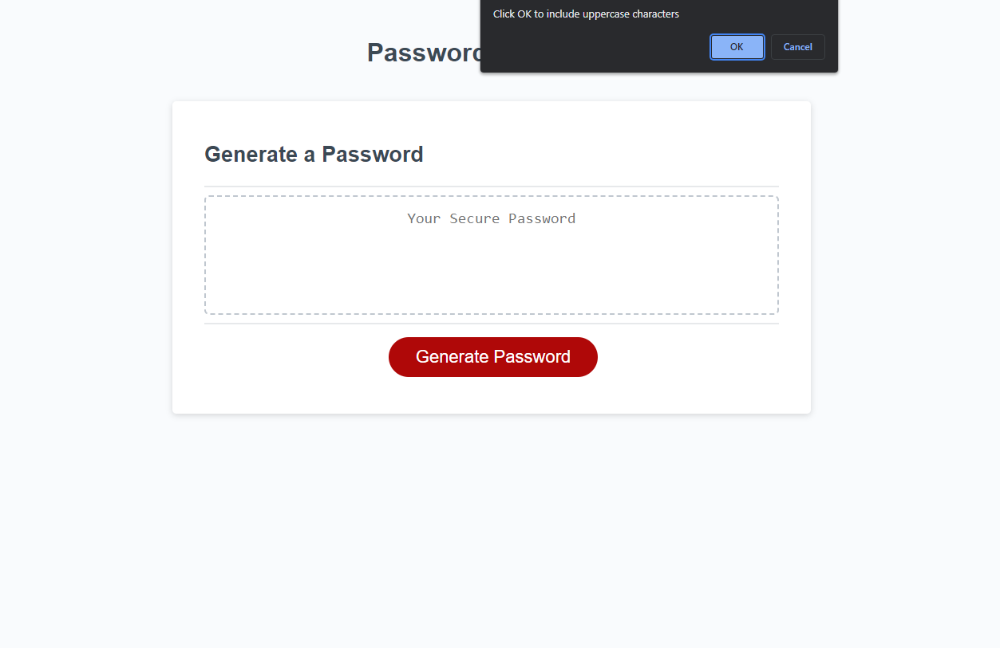
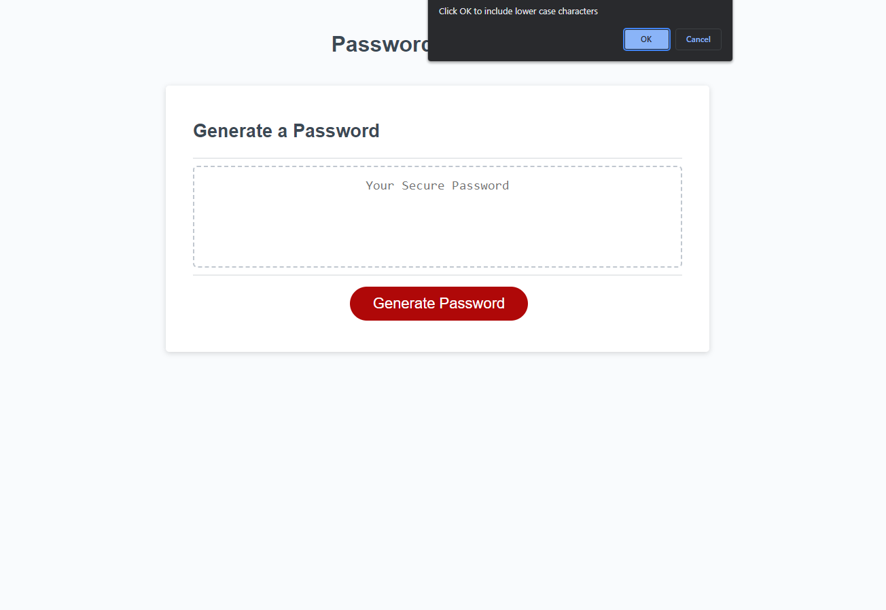
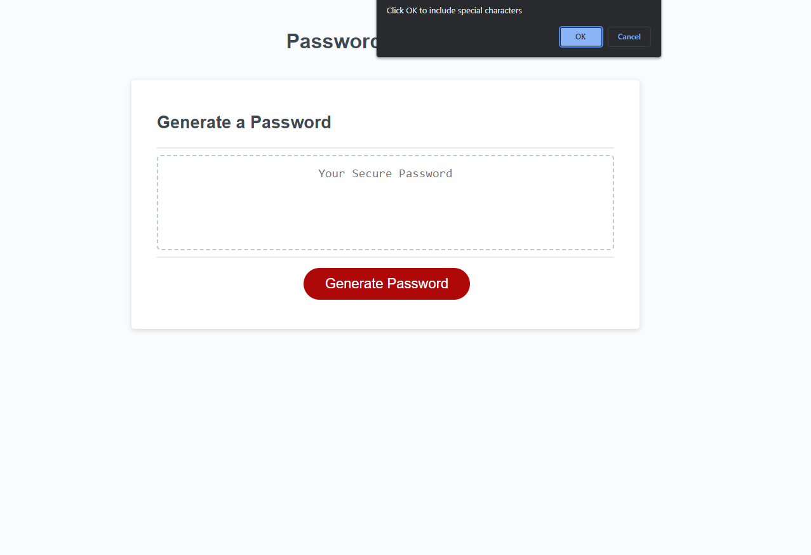
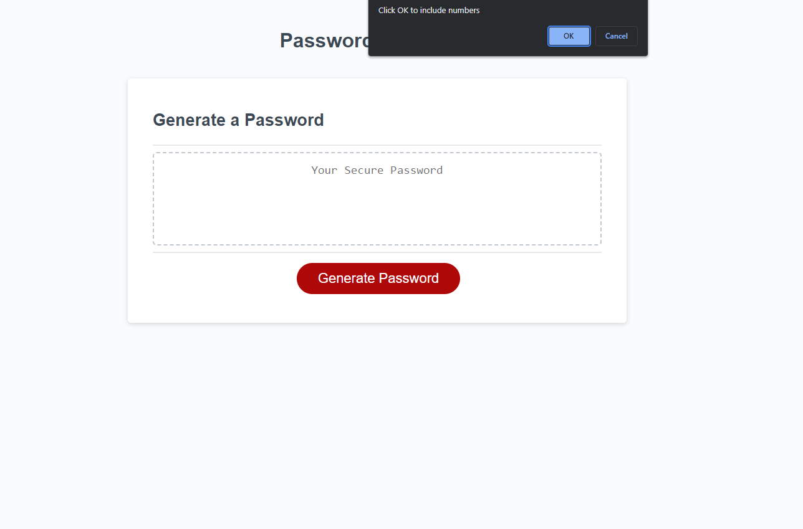

# 03 JavaScript: Password Generator

## Description
Passwords are important to protect sensitive information on websites that we use. Everyone needs a strong, random password to prevent unwanted access to sites used everyday. A password generator is one way to accomplish this. 

## Usage

An example of the page:

Link to deployed application: [Javascript Password Generator]()